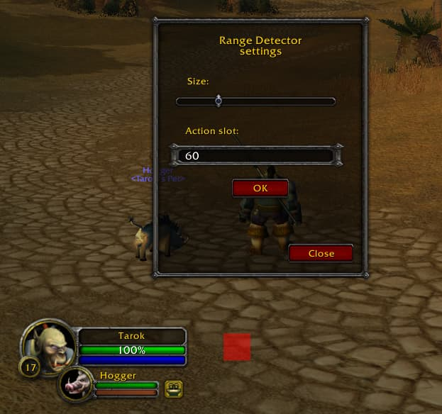

# RangeDetector
Vanilla 1.12.1 addon for World of Warcraft that shows if your skill is in range with a red or a green rectangle.

## Installation
1. Download **[Latest Version](https://github.com/MikeBeloborodov/RangeDetector/archive/refs/heads/main.zip)**
2. Unpack the Zip file
3. Rename the folder "RangeDetector-main" to "RangeDetector"
4. Copy "RangeDetector" into Wow-Directory\Interface\AddOns
5. Restart Wow

**Slash commands:**
* **/rdt** Opens menu